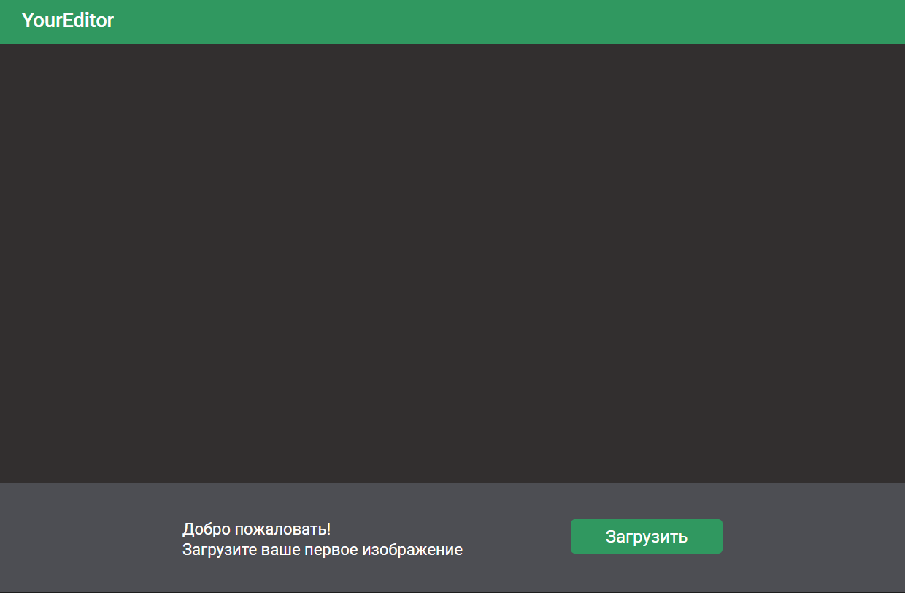

# ai-image-editor
Веб-приложение для наложения эффектов на изображение с помощью нейронной сети.
Пользователь загружает картинку, выбирает понравившийся фильтр и на выходе получает обработанное изображение, доступное для скачивания.

## Демо

|  | 
|:--:| 
| *Главная страница* |

|  | 
|:--:| 
| *Редактирование* |

|  | 
|:--:| 
| *Диалог* |

## Стек технологий
- Vue.js
- HTML/CSS
- Python 3.9
- Flask
- PyTorch

## Необходимые условия для использования продукта
### Клонирование
```
$ git clone https://github.com/atagiev/ai-image-editor
```
### Установка необходимых пакетов и компонентов:
#### Frontend
```
npm install
```
```
npm install -g yarn
```
```
npm install -g @vue/cli`
```
#### Backend
```
pip install -r requirements.txt
```
### Запуск
#### Frontend
```
npm run serve
```
#### Backend
```
python main.py
```

### Сборка
```
npm run build
```

### Lints and fixes files
```
npm run lint
```

## Ссылки на документацию
1) **Vue.js 2.0**: https://ru.vuejs.org/v2/guide/

2) **Vuex**: https://vuex.vuejs.org/ru/

3) **ES Lint**: https://eslint.org/docs/user-guide/getting-started

4) **Node.js**: https://nodejs.org/ru/docs/

5) **Axios**: https://axios-http.com/docs/intro

6) **Flask**: https://flask.palletsprojects.com/

7) **NumPy**: https://numpy.org/

8) **OpenCV**: https://opencv.org/

9) **Pillow**: https://pillow.readthedocs.io/

10) **PyTorch**: https://pytorch.org/

## Команда разработки
- Шредер Анастасия ([AnastasiaShreder](https://github.com/AnastasiaShreder))
- Шерман Марк ([Mark-Sherman-SE](https://github.com/Mark-Sherman-SE))
- Тагиев Андрей ([atagiev](https://github.com/atagiev))
- Стоцкая Елена ([elenastotskaya](https://github.com/elenastotskaya))

## Дополнительные ссылки
Дизайн-макет доступен для просмотра в [Figma](https://www.figma.com/file/8ccwptFYGIo63HJ33JM5LV/YourEditor?node-id=0%3A1) 
